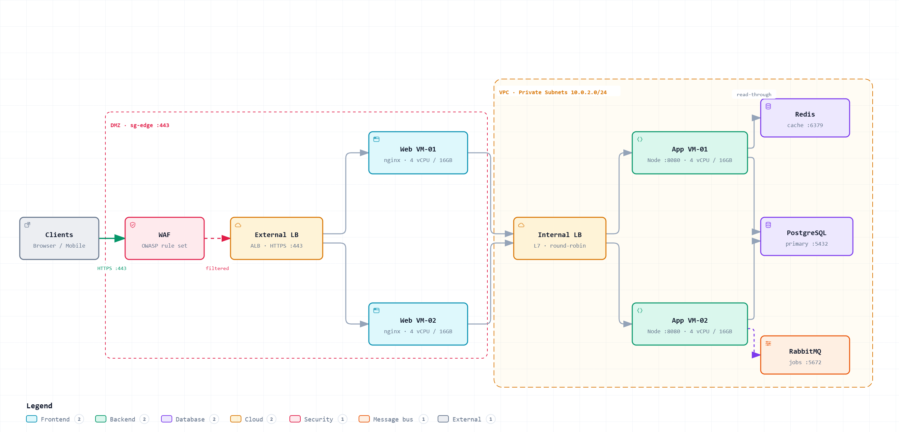

# archify-diagram-ps

<!-- HERO IMAGE: replace docs/hero.png with a screenshot or GIF of a rendered interactive diagram.
     Recommended: 1280×640, show a diagram with a node's detail panel open (ports/specs visible). -->
<p align="center">
  
</p>

**Turn your entire system into an interactive, detail-complete diagram — by answering questions, not drawing boxes.**

`archify-diagram-ps` is a Claude skill that acts like a senior architect. Ask it for an **architecture, sequence, or flow/data-flow** diagram and it runs a thorough, batched **interview** — WAF and policies, DMZ, single vs. multi-node, VMs vs. physical machines (cores / RAM / storage / IP), internal *and* external load balancers, web/app tiers, every microservice (name / port / tech stack / purpose), which services talk directly vs. route through the LB or DMZ, databases, message queues, service-to-service links, API and external-system integrations, and full traffic routing.

Once it has the complete picture and you confirm it, it hands off to the **[`archify`](https://github.com/tt-a1i/archify)** skill to render a validated, standalone, interactive HTML diagram where you can click any node and find its real specs, ports, and dependencies.

> **Core principle:** never guess, always ask. Unknown values are shown as `unknown` — never fabricated. **Completeness is the product.**

---

## What's in this repo

```
.
├── README.md                              ← you are here (setup guide)
├── PROMPT.md                              ← paste-into-Claude prompt that regenerates the skill from scratch
├── LICENSE
├── install.sh                            ← one-command install (macOS / Linux / Git Bash)
├── install.ps1                           ← one-command install (Windows PowerShell)
└── skills/
    └── archify-diagram-ps/
        ├── SKILL.md                      ← the skill
        └── references/
            └── mapping.md                ← interview-fact → archify-schema field mapping
```

---

## Prerequisites

1. **Claude Code** (or Claude with skills support) installed.
2. The **`archify`** skill installed — `archify-diagram-ps` is an interview wrapper; `archify` does the actual rendering, validation, and delivery.

Install `archify` first:

```bash
# via Claude Code (recommended): ask Claude to
#   "install the archify skill from https://github.com/tt-a1i/archify"
# or clone it into your skills directory:
git clone https://github.com/tt-a1i/archify ~/.claude/skills/archify
cd ~/.claude/skills/archify && npm install
```

---

## Install this skill

### Option A — one command

**macOS / Linux / Git Bash:**
```bash
bash install.sh
```

**Windows PowerShell:**
```powershell
./install.ps1
```

The installer copies `skills/archify-diagram-ps/` into your Claude skills directory (`~/.claude/skills/` by default; override with the `CLAUDE_SKILLS_DIR` environment variable).

### Option B — manual copy

Copy the folder `skills/archify-diagram-ps` into your Claude skills directory:

| Platform | Skills directory |
|---|---|
| macOS / Linux | `~/.claude/skills/` |
| Windows | `C:\Users\<you>\.claude\skills\` |

So it lands at `~/.claude/skills/archify-diagram-ps/SKILL.md`.

### Option C — regenerate from the prompt

Prefer to build it yourself? Paste the contents of **[`PROMPT.md`](./PROMPT.md)** into Claude and say *"Create this skill exactly as specified."*

---

## Verify & use

1. Restart Claude Code (or reload skills) so it picks up the new skill.
2. Trigger it:
   - Type `/archify-diagram-ps`, **or**
   - Just ask: *"Generate a full architecture diagram of my system."*
3. Answer the batched interview questions (skip anything with "unknown").
4. Confirm the recap → the skill renders an interactive HTML diagram via `archify` and tells you where it saved.

**Try it:**
> "Generate an architecture diagram for a 3-tier app: a WAF in front, an external ALB, two app VMs (4 cores / 16GB), a private Postgres, and a Redis cache."

---

## How it works

| Stage | What happens |
|---|---|
| **Detect** | Figures out architecture vs. sequence vs. flow, confirms in one line. |
| **Interview** | Asks 4–7 grouped questions per round, reflects back a summary each round, adapts to your answers. |
| **Confirm** | Shows a full structured recap of every node, tier, port, and route — waits for your OK. |
| **Render** | Maps the model to the right `archify` type and runs validate + deliver at `--quality showcase`. |
| **Refine** | Offers one round of edits, then re-validates. |

See [`skills/archify-diagram-ps/references/mapping.md`](./skills/archify-diagram-ps/references/mapping.md) for how interview facts map to archify schema fields.

---

## Troubleshooting

- **"archify not found"** → install the `archify` skill first (see Prerequisites).
- **Skill doesn't trigger** → confirm the file is at `~/.claude/skills/archify-diagram-ps/SKILL.md`, then restart Claude Code.
- **Diagram missing a detail** → that detail wasn't captured; run the refine step and add it, or re-run and answer that question.

---

## License

MIT — see [LICENSE](./LICENSE). The `archify` renderer is a separate MIT project by [tt-a1i](https://github.com/tt-a1i/archify).
